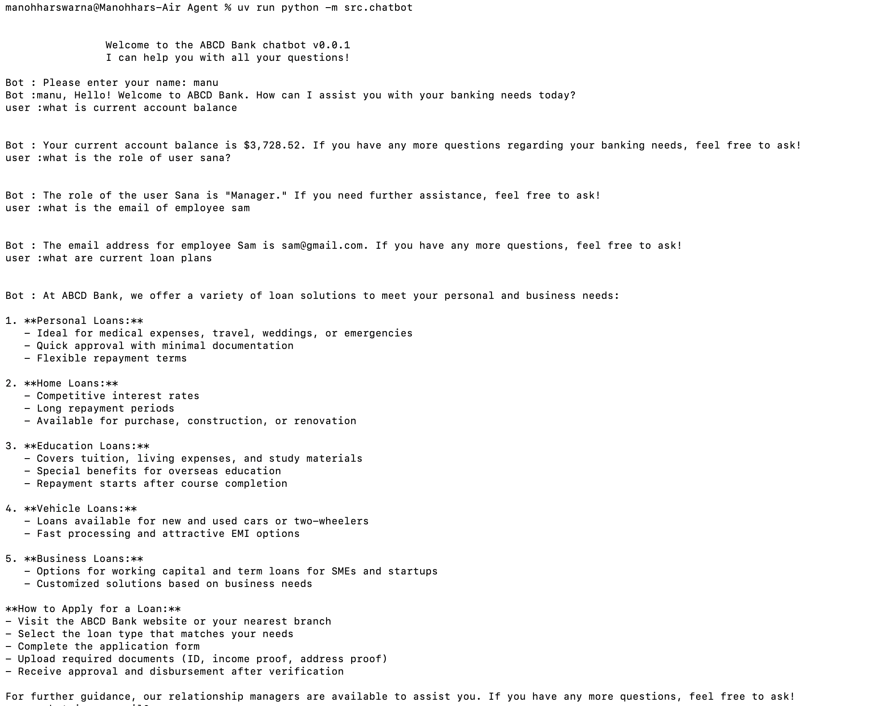

# 🏦 AI Agent Chatbot for Banking Domain

An intelligent **AI Agent–based Chatbot** designed for the **banking domain**, built using **LangChain agents**, **OpenAI LLMs**, **SQL**, and **external APIs**. The chatbot simulates realistic banking conversations and performs SQL-based reasoning, integrates external APIs, and maintains contextual memory with controlled privacy.

--- 

## 🛠️ Tech Stack
Python | Langchain | OPENAI | LLM

---

## ✨ Features
- The agent can connect to backend database and provide all details regarding to the emoloyees
- The agent can read the users csv file to handle/provide information regarding to the users.
- The agent can provide, current loan and credit details of the bank by reading bank documents under stories directory.
- The agent can store the chat conversations in backend DB for future needs.

---

## ⚙️ Setup Instructions

Follow the steps below to set up and run the **Banking AI Chatbot** application locally.

---

### 1️⃣ Clone the GitHub Repository

```bash
git clone https://github.com/manohhar-swarna/Banking-AI-Chatbot.git
cd Banking-AI-Chatbot
```
---

### 2️⃣ Install `uv` (Python Package Manager)

`uv` is used to manage Python versions and project dependencies.

```bash
curl -LsSf https://astral.sh/uv/install.sh | sh
```

---

### 3️⃣ Add `uv` to Your PATH

```bash
export PATH="$HOME/.local/bin:$PATH"
```

This ensures the `uv` command is available globally in your terminal.

---

### 4️⃣ Verify `uv` Installation

```bash
uv
```

If installed correctly, this command will display the `uv` help output.

---

### 5️⃣ Install Project Dependencies

```bash
uv sync
```

This command installs all required dependencies for the project.

---

### 6️⃣ Configure Environment Variables

Create a `.env` file in the project root directory and add the following:

```env
OPENAI_API_KEY=your_openai_api_key
RAPID_API_KEY=your_rapid_api_key
```

---

### 7️⃣ Database Setup

#### Create Employee Database and Table

```bash
uv run python -m src.employee_database.py
```

This initializes the `employees` table with required schema and sample data.

---

#### Create Chatbot Conversation Database and Table

```bash
uv run python -m src.chatbot_conversation_database.py
```

This creates the database and table used to store chatbot conversation history.

---

### 8️⃣ Run the Chatbot Application

```bash
uv run python -m src.chatbot
```

The AI Banking Chatbot will now start running in the terminal.

---

### CLI Screenshot



